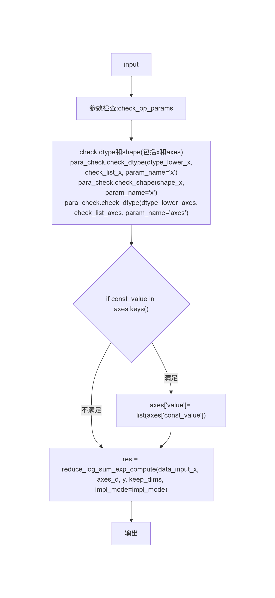
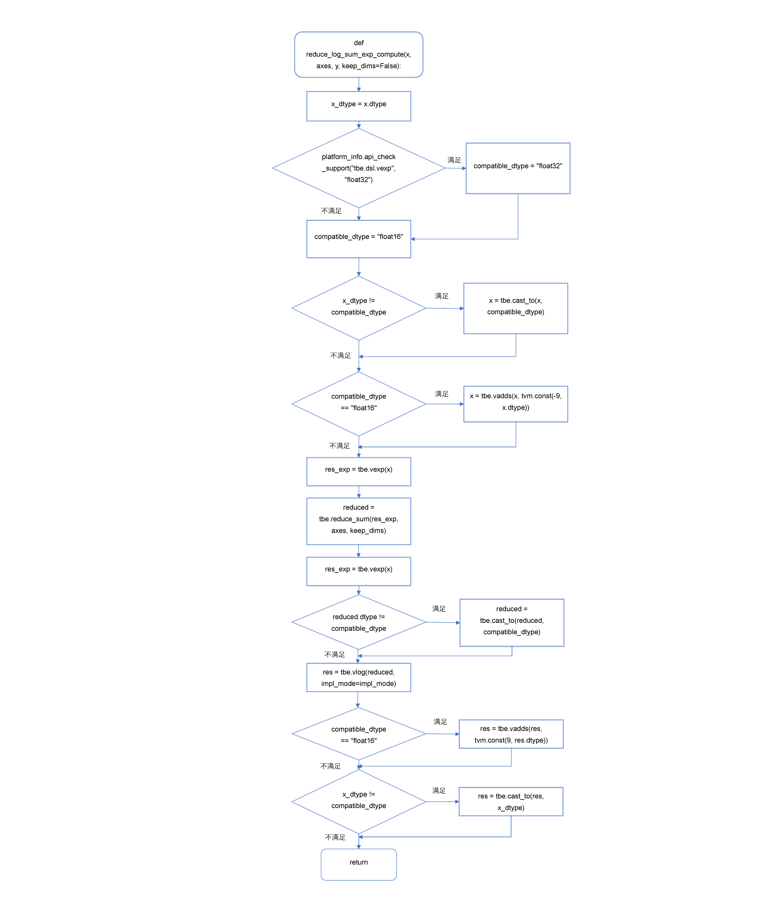
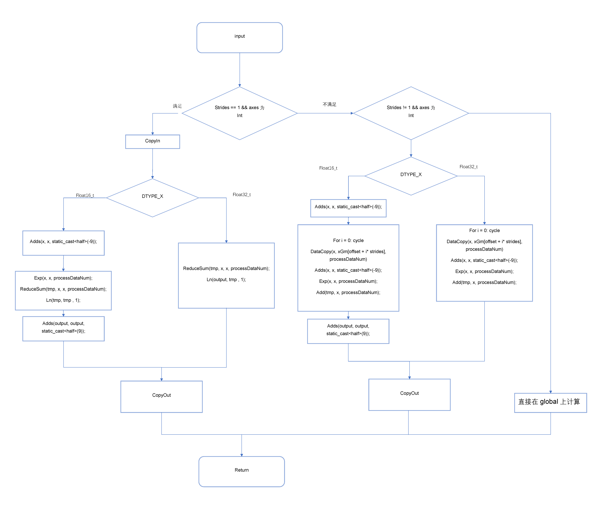

# 描述

## 背景介绍
###  ReduceLogSumExp算子实现优化
基于ReduceLogSumExp算子历史TBE版本使用Ascend C编程语言进行优化。
ReduceLogSumExp算子（TBE）实现路径和相关API路径
kernel实现：
/usr/local/Ascend/ascend-toolkit/latest/opp/built-in/op_impl/ai_core/tbe/impl/dynamic/reduce_log_sum_exp.py
算子原型：
/usr/local/Ascend/ascend-toolkit/latest/opp/built-in/op_proto/inc/reduce_ops.h
算子信息库：
/usr/local/Ascend/ascend-toolkit/latest/opp/built-in/op_impl/ai_core/tbe/config/ascend910b
### ReduceLogSumExp算子现状分析
通过对ReduceLogSumExp算子TBE版本的功能分析，当前支持的能力如下：
ReduceLogSumExp算子TBE版本的整体流程图如下图所示：
 
reduce_log_sum_exp_compute接口集体实现如下图所示：

## 算子原型

| 名称 | 类别 | dtype | format | shape | 介绍 |
|------|------|-------|--------|-------|------|
| x | 输入 | fp16/fp32 | ND | all | 输入张量，用于指定输出张量的形状和数据类型 |
| axes | 输入 | int32/int64 | ND | all | int / tuple / list |
| keep_dims	| 属性 | fp16/fp32 |  |  |Bool(默认false) |
| y | 输出 | fp16/fp32 | ND | all | 本算子输出：输入 x 大小除去reduce维数，若keep_dim == true则维数不变 |

## 算子支持型号
* Atlas A2 训练系列产品
* Atlas 800I A2推理产品

## 需求总体设计
### host侧设计：
tiling策略： 
当不需要广播的情况下，算子计算过程不涉及数据的维度信息，故在host侧将数据视为一维向量，仅考虑数据个数，不考虑数据维度信息。

在广播的情况下，在host侧获取x、axes等输入的相应shape大小以及各自的维度dim信息，
若获得的axes维度dim等于1，即规约维度为1个时，此时可以进行加速计算。此时记规约维度大小为cycle，除了规约维度全部维度大小之积为outputDataNum， 全部shape相乘结果即输入数据大小inputNum。否则在global上面计算。

任务均分：若可以加速计算时，coreNum 取最大，根据outputDataNum均分。否则coreNum = 1。
批量搬运： 
1)	分核策略
优先使用满核的原则。
如果核间能均分，可视作无大小核区分，大核小核数据块一致；
如果核间不能均分，需要将余出的数据块分配到前几个核上。
输入数据大小计算：通过outputDataNum参数和GetDataTypeLength函数获取输入数据的大小和类型长度，计算出输入数据的总字节数。
UB内存大小和核心数量获取：通过平台信息获取UB内存大小和核心数量，并根据这些信息调整核心数量coreDataNum。

2)	数据分块和内存优化策略
充分使用UB空间的原则。
需要考虑不同硬件的UB大小不同、是否开启double buffer、kernel侧API实现过程中是否需要临时数据的储存，综合考虑单核内切分的大小。
UB内存大小获取：通过GetCoreMemSize函数获取UB内存的大小，用于后续的数据切分计算。
Tile块计算：根据UB内存大小和预定义的BLOCK_SIZE及BUFFER_NUM，计算出每个Tile块的数据数量。
数据切分：将输入数据按照计算出的Tile块大小进行切分，计算出每个core需要处理的数据块数量和最后一个block的剩余数据量。
设置切分参数：将计算出的切分参数（如每个core的数据量、Tile块大小等）设置到TilingData中。
这些策略确保了数据在多个核心之间的均匀分布，并且在单个核心内进行了合理的切分，以提高并行处理的效率。计算时，每次搬运tileDataNum个数。

3)	tilingkey规划策略
需要tilingkey的情况：需要感知host侧信息对kernel侧走不同分支。如果无法加速tilingkey为1， 可以加速且规约维度不为最后一维时tilingkey为2， 如果可以加速且规约维度为最后一维时，tilingkey为3。  

### kernel侧设计：
若无法加速，则直接在global上面计算。
若可以加速，分两种情况计算：
1）规约维度为最后一维
进行Init和Process两个阶段，其中Process包括数据搬入（CopyIn）、计算（Compute）、搬出（CopyOut）三个阶段。
将分到该核的tile中的每个数逐个遍历，进行计算。
CopyIn：对于每个tile，直接读入tileDataNum个数据。
Compute：若输入为half，先将数据都加上-9，然后运算ReduceSum，Log。
CopyOut：对于输出，若输入为half，需要将数据加上9，需要DataCopy一个数即可。

2）规约维度为最后一维
进行Init和Process两个阶段，其中Process包括数据搬入（CopyIn）、计算（Compute）、搬出（CopyOut）三个阶段。

循环cycle次，进行计算。
CopyIn：对于每个tile，直接读入tileDataNum个数据。
Compute：若输入为half，先将数据都加上-9，运算Exp，将当前tile加到tmpBuffer中，以模拟ReduceSum的过程，然后重复上面CopyIn的步骤。
CopyOut：对于输出，若输入为half，需要将数据加上9，需要DataCopy整个tile。

流程图大致如下：

## 关联的Issue
暂无

## 测试
多个aclnn调用测试代码

## 文档更新
新增设计文档Readme.md

## 类型标签
- [ ] Bug修复
- [ ] 新特性
- [ ] 性能优化
- [ ] 文档更新
- [X] 其他，请描述：社区任务要求的设计文档
