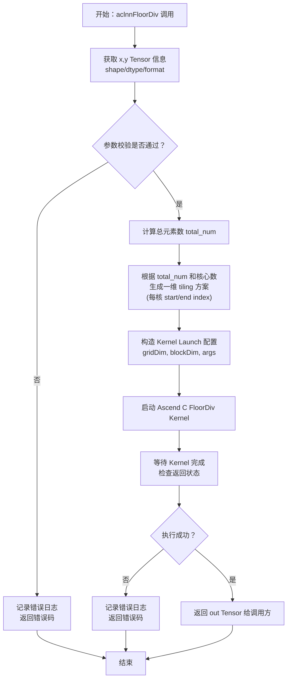
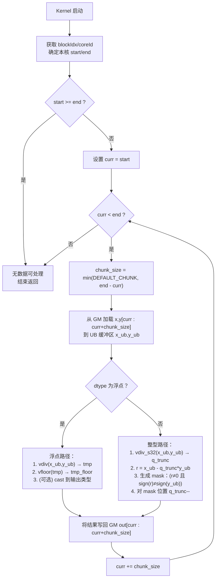

## 一、背景与目标

* **算子名称**：FloorDiv（整除向下取整）
* **实现目标**：参考内置 TBE 实现，用 Ascend C 在昇腾 NPU 上实现功能等价的 FloorDiv 算子，数据类型和数据格式对齐 TBE 版本（暂不支持 int64、double 与广播）。
* **性能目标**：在“使用所有核进行计算”场景下，Ascend C 实现性能 ≥ TBE 原算子的 95%。
* **交付物**：

  * Ascend C 自定义算子工程代码 + README
  * 多个 aclnn 调用测试用例 + 自验证报告
  * 按模板撰写的《FloorDiv 算子设计文档》

---

## 二、算子功能与接口设计

### 2.1 算子语义

对两个形状相同的张量 (X, Y) 做逐元素整除，并对结果向下取整：

* **浮点类型**
  [
  \text{out}_i = \left\lfloor \frac{x_i}{y_i} \right\rfloor
  ]

* **整型类型**（与框架/TBE 语义一致的“数学上的 floor 除法”）：
  先做截断除法得到 (q_{\text{trunc}})，再根据余数修正：
  [
  \begin{aligned}
  q_{\text{trunc}} &= \text{trunc_div}(x_i, y_i) \
  r &= x_i - q_{\text{trunc}} \cdot y_i \
  \text{out}*i &=
  \begin{cases}
  q*{\text{trunc}} - 1, & \text{if } (r \neq 0)\ \land\ \text{sign}(r) \neq \text{sign}(y_i) \
  q_{\text{trunc}}, & \text{otherwise}
  \end{cases}
  \end{aligned}
  ]

不额外处理除数为 0 的场景，行为与 TBE 参考实现保持一致。

### 2.2 输入输出规格

* 输入：

  * `x`: Tensor，支持 ND / NCHW / NHWC 等 TBE 支持的格式
  * `y`: Tensor，**形状与 x 相同**（当前版本不支持广播）
* 输出：

  * `out`: Tensor，形状与 `x` / `y` 相同
* 数据类型（示例，可按 TBE 实际支持补充/删减）：

  * 整型：`int8`, `int16`, `int32`, `uint8`
  * 浮点：`float16`, `float32`, `bfloat16`
  * 不支持：`int64`, `double`

### 2.3 属性与约束

* 无额外算子属性（无 axis、round_mode 等）。
* 约束：

  * 输入形状一致（无广播）
  * 支持静态/动态 shape（按 CANN 要求实现泛化流程）
  * 数据类型、格式需与 TBE 算子完全对齐（除了任务中允许暂不支持的类型/广播）

---

## 三、总体实现方案

### 3.1 Host 侧流程

1. 解析输入 Tensor（shape、dtype、format）。
2. 做参数与约束校验（shape 一致、dtype 支持等）。
3. 构造 Launch 配置信息：总元素数 `total_num`、block 数、每个核负责的区间。
4. 调用 CANN 接口启动 Ascend C Kernel。
5. 等待 Kernel 执行完成，返回结果。

### 3.2 Device 侧（Kernel 调度）方案

* 使用 **一维扁平化 tiling**：将多维 tensor 展开成一维 `total_num`，按核数均匀划分区间 `[start, end)`。
* 每个核内部采用 **“GM ↔ UB 小块搬运 + 向量指令计算 + 回写 GM”** 的 pipeline。
* 对大尺寸 tensor 可预留双 buffer（UB ping-pong）优化带宽利用。

---

## 四、整体流程图（算子调用到结果返回）

你可以直接把下面的 mermaid 代码粘到支持 mermaid 的文档/工具中画图，也可以按节点手动画 Visio / PPT。

---

## 五、算法与 Kernel 内部设计

### 5.1 核心思路

* 将输入视作一维数组，长度 `total_num`。
* 每个核处理区间 `[start, end)`，循环分块：

  1. 从 GM 读取一小块 `chunk_size` 元素到 UB。
  2. 根据 dtype 走浮点路径或整型路径。
  3. 结果写回 GM。
  4. 处理下一个块，直到 `end`。

### 5.2 浮点路径

1. `vdiv`：逐元素做 `x / y` 得到中间结果 `tmp`。
2. `vfloor`：对 `tmp` 做向下取整得到 `tmp_floor`。
3. 如果输出是整型（比如框架定义如此），再做一次 `cast` 到对应整型。

### 5.3 整型路径

1. 使用硬件整除 `vdiv_s32` 得到截断商 `q_trunc`（朝 0 截断）。
2. 计算余数 `r = x - q_trunc * y`。
3. 利用向量比较得到需要修正的位置 mask：
   `(r != 0) && sign(r) != sign(y)`。
4. 对 mask 为真位置执行 `q_trunc = q_trunc - 1`，得到 floor 商。
5. 将结果向量写回。

---

## 六、Kernel 内部详细流程图

---

## 七、性能优化设计要点

1. **一维扁平化 + 线性访问**：保证 GM 访问连续，兼顾所有数据格式（ND/NCHW… 展平后等价）。
2. **多核负载均衡**：按 `total_num / core_num` 均匀分配区间，尾部做少量补偿。
3. **向量化指令优先**：

   * 尽量使用 `vdiv`, `vfloor`, `vsub`, `vmul`, `vcmp` 等向量指令。
   * 避免大量标量 if/for。
4. **UB 利用**：

   * 结合 910B UB 容量，设定合适 `DEFAULT_CHUNK`，兼顾带宽与并发。
   * 预留双 buffer 能力（后期需要时再开启）。
5. **减少分支**：

   * dtype 分支放在核外或块外（按 dtype 选不同 kernel/不同分支），避免在 inner loop 频繁判断。
6. **性能验证**：

   * 与 TBE 原算子同 shape、同数据类型、同核数对比，统计整体执行时间，确保 ≥95%。

---

## 八、精度与异常处理设计

1. **浮点精度**：

   * 使用框架统一的 `floor` 与 `div`，验证误差满足：

     * `float32`：1e-4
     * `float16/bfloat16`：1e-3
2. **负数场景验证**：

   * 重点测试：`(-3, 2)`, `(3, -2)`, `(-3, -2)` 等组合，保证与 TBE 一致。
3. **除数为 0**：

   * 不做额外判断，由底层/框架保证输入合法或产生与 TBE 相同的行为。
4. **溢出处理**：

   * 对整型，按硬件/框架默认行为处理（例如饱和或回绕），只需保证与 TBE 结果 bit-level 一致。

---

## 十、自验证与测试设计方案

### 10.1 功能测试用例设计

1. **数据类型覆盖**：

   * `int8`, `int16`, `int32`, `uint8`, `float16`, `float32`, `bfloat16`
2. **形状覆盖**：

   * 标量：`[]`
   * 小张量：`[2, 3]`, `[2, 3, 4]`
   * 中大张量：`[32, 64]`, `[8, 16, 32]`, `[4, 8, 16, 32]` 等
   * 不同数据格式（ND / NCHW / NHWC...，与 TBE 对齐）
3. **数值场景**：

   * 只含正数
   * 含负数（分母正/负两种）
   * 大数边界值（接近类型上限/下限）
   * 随机数据

**对比方式**：

* 使用 TBE 内置 FloorDiv 或 Host 侧 Ref 实现作为基准，检查结果逐元素相等/在容许误差内。

### 10.2 性能测试

1. 选取几组典型大形状（例如：`[64, 128, 256]`, `[32, 1024, 1024]` 等）。
2. 在 Atlas A2 / 910B 上固定核数、固定环境下多次运行：

   * 统计本 Ascend C 实现平均耗时
   * 统计 TBE 实现平均耗时
3. 计算性能比值 `Speed_C / Speed_TBE`，确保 ≥95%。
