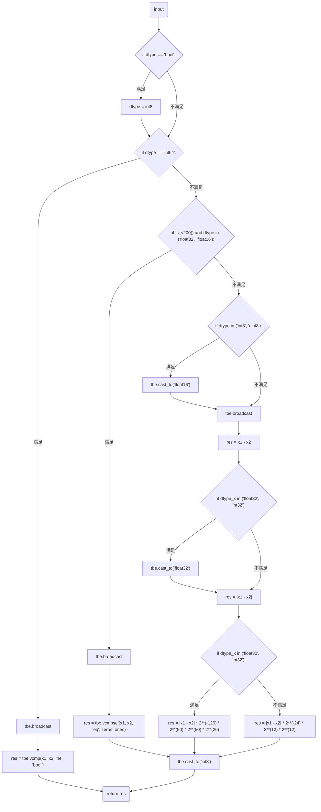
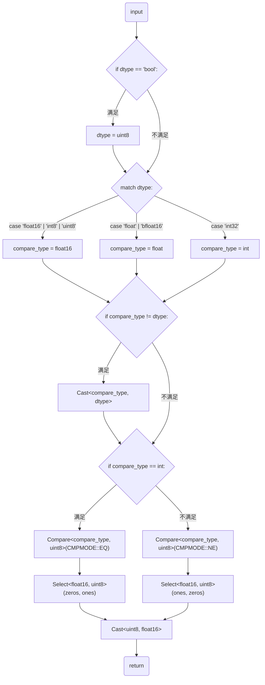

# 需求背景
##	背景介绍
### NotEqual算子实现优化
基于NotEqual算子历史TBE版本使用Ascend C编程语言进行优化。

NotEqual算子（TBE）实现路径和算子信息库路径
- NotEqual算子实现路径为：/usr/local/Ascend/ascend-toolkit/latest/opp/built-in/op_impl/ai_core/tbe/impl/dynamic/not_equal.py
- 算子信息库路径：/usr/local/Ascend/ascend-toolkit/latest/opp/built-in/op_impl/ai_core/tbe/config/ascend910b/aic-ascend910b-ops-info.json
### NotEqual算子现状分析
通过对NotEqual算子TBE版本的功能分析，当前支持的能力如下：
- 支持bfloat16/bool/float16/float32/int8/int32/int64/uint8/uint64九种格式的输入。
- NotEqual算子涉及到对输入数据进行广播（输入数据的shape调整到相同大小）
- 在对输入数据进行广播操作后，计算y = (x1 != x2)

NotEqual算子TBE版本的整体流程图如下图所示：

# 需求分析
## 外部组件依赖
不涉及外部组件依赖。
## 内部适配模块
适配Aclnn接口和图模式调用。
## 需求模块设计
### 算子原型
1. 原型设计

    | 名称 | 类别 | dtype                                                       | format | shape | 介绍 |
    |----|----|-------------------------------------------------------------|--------|-------|----|
    | x1 | 输入 | bfloat16/bool/float16/float32/int8/int32/int64/uint8/uint64 | ND     | all   | 输入 |
    | x2 | 输入 | bfloat16/bool/float16/float32/int8/int32/int64/uint8/uint64 | ND     | all   | 输入 |
    | y  | 输出 | bool                                                        | ND     | 同输入   | 输出 |
2. 相关约束

    Atlas A3 训练系列产品/Atlas A3 推理系列产品：bfloat16/bool/float16/float32/int8/int32/int64/uint8

    Atlas A2 训练系列产品/Atlas A2 推理系列产品：bfloat16/bool/float16/float32/int8/int32/int64/uint8

    Atlas 200I/500 A2 推理产品：bool/float16/float32/int8/int32/int64/uint8

    Atlas 推理系列产品：bool/float16/float32/int8/int32/int64/uint8/uint64

    Atlas 训练系列产品：bool/float16/float32/int8/int32/int64/uint8/uint64
# 需求详细设计
## 使能方式
| 上层框架         | 涉及的框架勾选 |
|--------------|---------|
| TF训练/推理      |         |
| Pytorch训练/推理 |         |
| ATC推理        | √       |
| Aclnn直调      | √       |
| OPAT调优       |         |
| SGAT子图切分     |         |
## 需求总体设计
### host侧设计：
tiling策略：
1. 当不需要广播的情况下，算子计算过程不涉及数据的维度信息，故在host侧将数据视为一维向量，仅考虑数据个数，不考虑数据维度信息。
2. 优先使用满核的原则。
### kernel侧设计：
1. 根据DTYPE_X1自动选择对应类型的模板函数。
2. 各核处理的输入数据以512B为单位均分。
3. 三个输入输出的TQue都开启double buffer、均分UB空间。
4. 循环执行数据搬入（CopyIn）、计算（Compute）、搬出（CopyOut）三个阶段，Compute阶段根据模板数据类型调用相应的NotEqual函数。
5. Ascend C的NotEqual算子流程见下图。

##	支持硬件
Atlas A2 训练系列产品/Atlas A2 推理系列产品
##	算子约束限制
不支持广播，不支持int64。
# 可维可测分析
## 精度标准/性能标准
| 验收标准 | 描述(不涉及说明原因) | 标准来源 |
|------|-------------|------|
| 精度标准 | 不低于TBE版本    |      |
| 性能标准 | 不低于TBE版本    |      |
## 兼容性分析
新算子，不涉及兼容性分析
