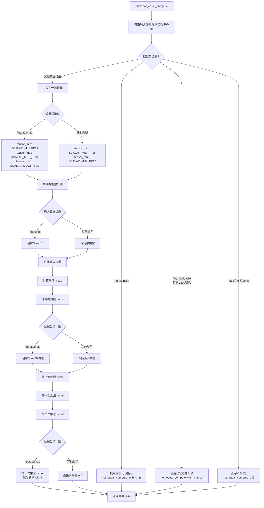

# 1 需求背景（required）
## 1.1 需求来源
cann训练营二期算子开发任务
## 1.2 背景介绍
### 1.2.1 NotEqual算子实现优化
基于NotEqual算子历史TBE版本使用Ascend C编程语言进行优化。
* 包含相同数据类型和相同数据格式，其中int64，double数据类型可暂不支持，广播操作可暂不支持。
* 算子性能要求持平原有TBE实现算子，当前可暂只支持在使用所有核进行计算时性能需不低于原有TBE算子95%
### 1.2.2 NotEqual算子现状分析
通过对NotEqual算子TBE版本的功能分析，当前支持的能力如下：
+ ①入参x,y 支持float16，float32，int32，bfloat16，int32，int64，uint64几种格式的输入。
+ ②NotEqual算子涉及到对输入数据进行广播（输入数据的shape调整到相同大小）
+ ③在对输入数据进行广播操作后，调用vcmp、vcmpsel和vsel接口实现相应的表达式：x != y
***
NotEqual算子TBE版本的整体流程图如下图所示：

***
# 2需求分析
## 2.1 外部组件依赖
不涉及外部组件依赖。
## 2.2 内部适配模块
适配Aclnn接口调用。
## 2.3 需求模块设计
### 2.3.1 算子原型

| 名称 | 类别 | dtype | format |shape |
|------|------|:------:|------|:----:|
| x | 输入 | fp16/fp32/int32 | ND |all |
| y | 输入 | fp16/fp32/int32 | ND |all |
| z | 输出 | bool | ND | 同输入 |
### 2.3.2 相关约束
无。
# 3 需求详细设计
## 3.1 使能方式
| 上层框架 | 涉及勾选 |
|------|----------|
| TF训练/推理 | - |
| Pytorch训练/推理| - |
| ATC推理 | &#x2705; |
| Aclnn直调| &#x2705; |

## 3.2 需求总体设计
### 3.2.1  host侧设计：
tiling策略： 
当不需要广播的情况下，算子计算过程不涉及数据的维度信息，故在host侧将数据视为一维向量，仅考虑数据个数，不考虑数据维度信息。
在广播的情况下，在host侧获取x,y输入的相应shape大小以及各自的维度dim信息，total_length变量传到kernel侧。
任务均分：coreNum 根据输入长度和块大小动态调整，确保每个核心处理的数据块数均匀。
批量搬运：tileBlockNum 和 tileDataNum 计算单次搬运的数据量，通过 finalSmallTileNum 和 finalBigTileNum 确定小核/大核的搬运次数，将多次搬运合并为批量操作，减少冗余开销。尾块的处理逻辑确保不完整块也能被合并到计算流程中，避免数据碎片。  

__1)分核策略__
优先使用满核的原则。
如果核间能均分，可视作无大小核区分，大核小核数据块一致；
如果核间不能均分，需要将余出的数据块分配到前几个核上。
输入数据大小计算：通过GetInputShape和GetDataTypeLength函数获取输入数据的大小和类型长度，计算出输入数据的总字节数。
UB内存大小和核心数量获取：通过平台信息获取UB内存大小和核心数量，并根据这些信息调整核心数量。  

__2)数据分块和内存优化策略__
充分使用UB空间的原则。
需要考虑不同硬件的UB大小不同、是否开启double buffer、kernel侧API实现过程中是否需要临时数据的储存，综合考虑单核内切分的大小。
UB内存大小获取：通过GetCoreMemSize函数获取UB内存的大小，用于后续的数据切分计算。
Tile块计算：根据UB内存大小和预定义的BLOCK_SIZE及BUFFER_NUM，计算出每个Tile块的数据数量。
数据切分：将输入数据按照计算出的Tile块大小进行切分，计算出每个core需要处理的数据块数量和最后一个block的剩余数据量。
设置切分参数：将计算出的切分参数（如每个core的数据量、Tile块大小等）设置到TilingData对象中。
这些策略确保了数据在多个核心之间的均匀分布，并且在单个核心内进行了合理的切分，以提高并行处理的效率。  

__3)tilingkey规划策略__
不涉及。
### 3.2.2 kernel侧设计：
进行Init和Process两个阶段，其中Process包括数据搬入（CopyIn）、计算（Compute）、搬出（CopyOut）三个阶段。  
1)由于支持Ascend C开发的硬件中算子支持float16、float32、int32数据的输入，可以直接将bfloat16的数据都转成float32进行计算，其余数据类型保持原类型计算。  
2)在kernel侧的copyin阶段完成获取，首先获取host侧存储各个输入shape的一维数组，通过特定的函数完成指定数组元素的地址映射。  
3)根据不同的数据类型执行不同的比较。
## 3.3支持硬件
|  硬件   | 支持  |
|  ----  | ----  |
| Atlas 800I/T A2  | &#x2705; |
## 3.4算子约束限制
* 不支持广播；
* 不支持double数据类型；
* 不支持int64;
* Atlas A2 训练系列产品/Atlas 800I A2 推理产品，支持的数据类型为：half/float（所有CMPMODE都支持）， int32_t（只支持CMPMODE::EQ）
# 4 特性交叉分析

# 5 可维可测分析
## 5.1精度标准/性能标准
| 验收标准 | 描述(不涉及说明原因) | 标准来源 |
| :-----:| :----: | :----: |
| 精度标准 | 不低于TBE版本 | - |
| 性能标准 | 不低于TBE版本95% | - |
## 5.2兼容性分析
新算子，不涉及兼容性分析