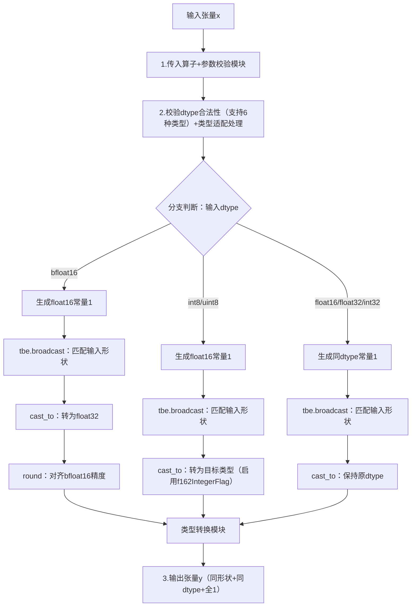
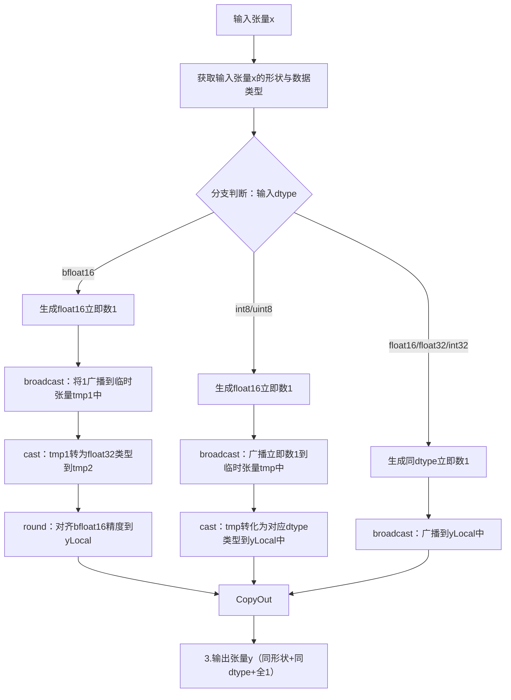

# 描述
背景信息
基于OnesLike算子的TBE版本在昇腾NPU上使用Ascend C编程语言实现相同功能的算子。

OnesLike算子现状分析
对TBE版本的OnesLike进行功能分析，当前支持的能力如下：
1 输入 x 支持 float16、float32、int32、int8、uint8、bfloat16 六种格式。
2 算子要求输出 y 与输入 x 形状完全一致，通过广播操作将常量 1 扩展为与 x 相同的形状。
3 逻辑表达式y=1
4类型处理逻辑：对于 bfloat16类型输入，先生成 float16 类型的常量 1，广播后转换为 float32，再调用 round 操作对齐 bfloat16 精度；对于 int8和uint8 输入，先以 float16 生成常量 1 并广播，再转换回原类型（启用整数转换标志确保精度）；对于 float16、float32、int32 输入，直接生成同类型的常量 1 并广播，保持类型一致。
5使用 broadcast cast round 等接口实现广播、类型转换、对齐操作。

OnesLike算子TBE版本的整体流程图：

算子原型

| 名称 | 类别 | dtype | format | shape | 介绍 |
|------|------|-------|--------|-------|------|
| x | 输入 | fp16/fp32/int32/int8/uint8/bfloat16 | ND | all | 输入张量，用于指定输出张量的形状和数据类型 |
| y | 输出 | 与输入 x 一致 | ND | 与输入 x 一致 | 本算子输出：与输入 x 同形、同 dtype 的全 1 张量（y[i] = 1） |

算子支持型号
Atlas A2 训练系列产品/Atlas 800I A2推理产品

host侧设计方案
算子核心是生成与输入 x 同形同 dtype 的全 1 张量，计算过程不依赖输入 x 的具体数值，仅需其形状和类型信息。host 侧将数据视为一维向量，仅关注数据总个数，不涉及维度解析。
任务均分：coreNum 根据输入数据总个数和预设块大小动态调整，确保每个核心处理的数据块数量均匀，避免负载失衡。
批量搬运：通过计算 tileBlockNum（单次搬运的块数）和 tileDataNum（单块数据量），确定 finalSmallTileNum（小核搬运次数）和 finalBigTileNum（大核搬运次数），将多次零散搬运合并为批量操作，降低 IO 开销。尾块处理逻辑确保非完整数据块能被正常纳入计算流程，避免数据丢失或碎片。

分核策略
优先使用满核的原则。
如果核间能均分，可视作无大小核区分，大核小核数据块一致；
如果核间不能均分，需要将余出的数据块分配到前几个核上。
输入数据大小计算：通过GetInputShape和GetDataTypeLength函数获取输入数据的大小和类型长度，计算出输入数据的总字节数。
UB内存大小和核心数量获取：通过平台信息获取UB内存大小和核心数量，并根据这些信息调整核心数量。

数据切分和内存优化策略
充分使用UB空间的原则。
不同数据类型，需要的临时变量不同，因此根据临时变量的多少动态划分UB，开启double buffer
UB内存大小获取：通过GetCoreMemSize函数获取UB内存的大小，用于后续的数据切分计算。
Tile块计算：根据UB内存大小和预定义的BLOCK_SIZE及BUFFER_NUM，计算出每个Tile块的数据数量。
数据切分：将输入数据按照计算出的Tile块大小进行切分，计算出每个core需要处理的数据块数量和最后一个block的剩余数据量。
设置切分参数：将计算出的切分参数（如每个core的数据量、Tile块大小等）设置到TilingData对象中。
这些策略确保了数据在多个核心之间的均匀分布，并且在单个核心内进行了合理的切分，以提高并行处理的效率。

tilingkey规划策略：
根据输入张量的数据类型确定不同的tilingkey用于kernel侧核函数根据不同数据类型进入不同process()。

kernel侧设计方案：
进行Init和Process两个阶段，其中Process包括数据搬入（CopyIn）、计算（Compute）、搬出（CopyOut）三个阶段,但无需输入数据参与计算，故而省略数据搬入（CopyIn），因此只有计算（Compute）、搬出（CopyOut）两个阶段。
根据不同的tilingkey进入不同的process，进而进入不同的Compute，从而调用Duplicate接口对输出张量用不同数据类型的1填充。
Ascend C的OneLike算子流程见下图：

## 关联的Issue
暂无

## 测试
多个aclnn调用测试代码

## 文档更新
新增设计文档Readme.md

## 类型标签
- [ ] Bug修复
- [ ] 新特性
- [ ] 性能优化
- [ ] 文档更新
- [X] 其他，请描述：社区任务要求的设计文档

