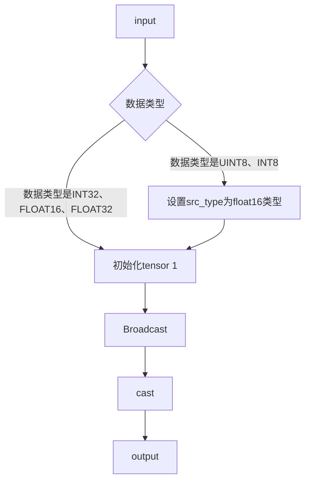
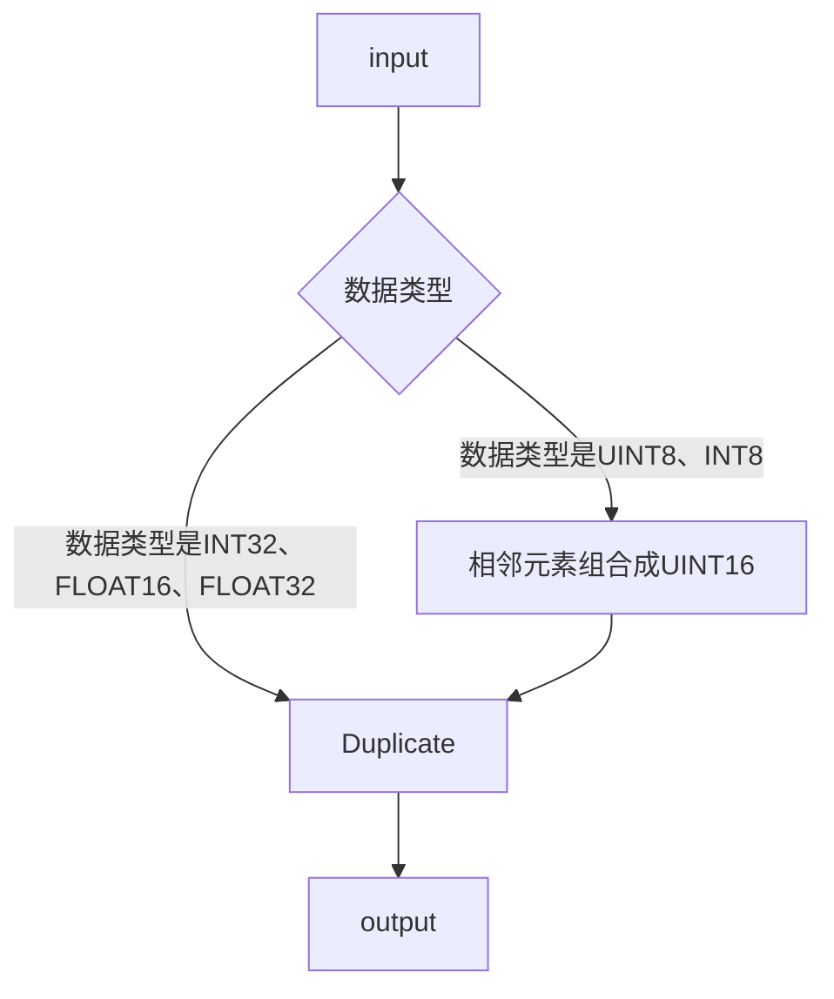

# aclnnOnesLike

## 产品支持情况

| 产品                                                                            | 是否支持 |
| :------------------------------------------------------------------------------ | :------: |
| <term>Atlas A2 训练系列产品/Atlas 800I A2 推理产品/A200I A2 Box 异构组件</term> |    √     |

## 功能说明

- 算子功能: 创建一个与给定张量形状相同且所有元素都为 1 的新张量。

## 算子原型设计

| 参数名 | 类别     | 描述                                         | 数据类型                             | 数据格式 |
| :----- | :------- | :------------------------------------------- | :----------------------------------- | :------- |
| input  | 输入张量 | 输入张量。                                   | FLOAT16、FLOAT32、INT32、UINT8、INT8 | ND       |
| output | 输出张量 | 与输入张量形状相同的新张量，所有元素都为 1。 | 与input一致                          | ND       |

- <term>Atlas A2 训练系列产品/Atlas 800I A2 推理产品/A200I A2 Box 异构组件</term>：数据类型支持FLOAT16、FLOAT32、INT32、UINT8、INT8。

## 约束说明

无

## 调用说明

| 调用方式  | 样例代码                                                               | 说明                                           |
| :-------- | :--------------------------------------------------------------------- | :--------------------------------------------- |
| aclnn接口 | [test_ones_like](ops-math/ones_like/examples/test_aclnn_ones_like.cpp) | 通过[aclnnOnesLike]接口方式调用ones_like算子。 |

## 需求来源

### ones_like算子实现优化

基于ones_like算子历史TBE版本使用Ascend C编程语言进行优化。
ones_like算子（TBE）实现路径和相关API路径
ones_like算子实现路径为：/usr/local/Ascend/ascend-toolkit/latest/opp/built-in/op_impl/ai_core/tbe/impl
ones_like算子实现中的API路径：/usr/local/Ascend/ascend-toolkit/latest/python/site-packages/tbe/dsl

### ones_like算子现状分析

通过对ones_like算子TBE版本的功能分析，当前支持的能力如下：

1. ones_like算子输入数据input_data支持FLOAT16、FLOAT32、INT32、UINT8、INT8格式的输入。
2. ones_like算子TBE版本的整体流程图如下图所示：

## 需求总体设计

### host侧设计

#### tiling策略

1. 分核策略
   1. 优先使用满核的原则。
   2. 如果核间能均分，可视作无大小核区分，大核小核数据块一致；
   3. 如果核间不能均分，需要将余出的数据块分配到前几个核上。
   4. 数据量当能单核处理的情况下使用单核，否者使用满核进行加速处理。

2. 单core内切分策略
   1. 充分使用UB空间的原则。
   2. 需要考虑不同硬件的UB大小不同、是否开启double buffer、kernel侧API实现过程中是否需要临时数据的储存，综合考虑单核内切分的大小。

3. tilingkey规划策略
   1. 需要tilingkey的情况：需要感知host侧信息对kernel侧走不同分支。
   2. 不需要tilingkey的情况：host侧的处理是通用的，无特殊属性等决定kernel的分支

### kernel侧设计

进行Init和Process两个阶段，其中Process包括计算（Compute）、搬出（CopyOut）两个阶段。

1. Ascenones_like算子流程见下图。

