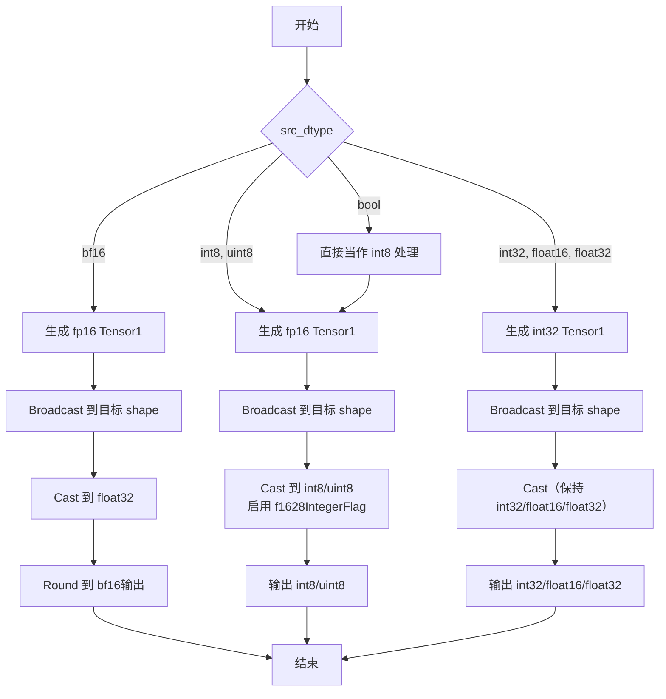
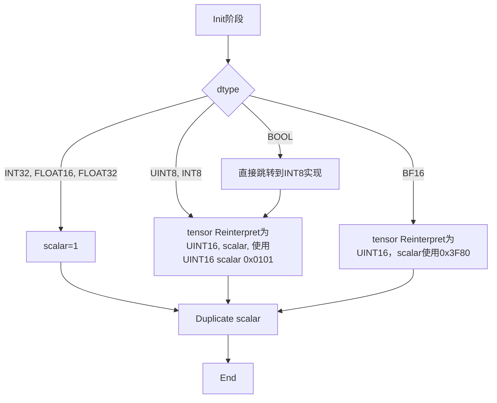

## 需求背景	

### 需求来源			
- 通过社区任务完成开源仓算子贡献的需求

### 背景介绍

- 算子功能: 创建一个与给定张量形状相同且所有元素都为 1 的新张量。
1. ones_like算子实现优化
   - kernel实现：
      - /usr/local/Ascend/ascend-toolkit/latest/opp/built-in/op_impl/ai_core/tbe/impl/dynamic/ones_like.py
   - 算子原型：
      - /usr/local/Ascend/ascend-toolkit/latest/opp/built-in/op_proto/inc/elewise_calculation_ops.h
   - 算子信息库：
      - /usr/local/Ascend/ascend-toolkit/latest/opp/built-in/op_impl/ai_core/tbe/config/ascend910b/aic-ascend910b-ops-info.json

2. ones_like算子现状分析	
   1. TBE算子支持的数据类型和数据格式
      - ones_like算子输入数据input_data支持FLOAT16、FLOAT32、INT32、INT8、UINT8、BF16、BOOL数据类型，ND数据格式的输入。
      - 输出数据类型与输入数据类型保持一致。
   2. TBE算子实现描述
      1. 对bf16数据类型，先生成fp16类型的tensor 1，然后broadcast到目标shape，再cast到float32类型，最后round到bf16类型。
      2. 对int8、uint8数据类型，先生成fp16类型的tensor 1，然后broadcast到目标shape，再cast（使能f1628IntegerFlag）到int8/uint8类型。
      3. 对bool数据类型，当作int8类型处理。
      4. 对其他数据类型（int32、float16、float32），生成对应类型的tensor 1，直接broadcast到目标shape，最后进行cast。
   3. TBE算子实现流程图	
      - ones_like算子TBE版本的整体流程图如下图所示：



## 需求分析

1. 外部组件依赖
   <!-- 根据实际情况选择已适配的外部依赖 -->
2. 内部适配模块			
   <!-- 根据实际情况选择已适配的内部模块 -->
3. 需求模块设计	
   1. AscendC算子原型		
      <!-- 除《算子任务书》中不要求适配的部分外，其他TBE算子对齐 -->
   2. AscendC算子相关约束		
      <!-- 填写与TBE算子相比缺失那些功能 -->

## 需求详细设计

### 使能方式

参考ops-math/math/ones_like已有API，使用aclnnInplaceOneGetWorkspaceSize和aclnnInplaceOne接口，使用此算子。

### 需求总体设计	

#### host侧设计

1. 分核策略	
   1. 优先使用满核的原则。
   2. 如果核间能均分，可视作无大小核区分，大核小核数据块一致；
   3. 如果核间不能均分，需要将余出的数据块分配到前几个核上。
   4. 计算方法：
```c
// block_num 表示有几个核，size 表示数据量
// 计算每个核处理的数据量
block_size = size / block_num;
// 大核个数
formerNum = (size % block_num) == 0 ? block_num : (size % block_num);
// 小核个数
tailNum = block_num - formerNum;
// 小核数据量
tailLength = block_size;
// 大核数据量
formerLength = block_size + (tailNum == 0 ? 0 : 1);
```
   1. 数据量很小时，直接使用单核处理，不再用多核。

1. 数据分块和内存优化策略	
   单core内切分策略
   1. 充分使用UB空间的原则。
   2. 需要考虑不同硬件的UB大小不同、是否开启double buffer、kernel侧API实现过程中是否需要临时数据的储存，综合考虑单核内切分的大小。
   3. 计算方法：
```c
// 计算每个tile的最大数据量
max_tile_len = size_ub / sizeof(dtype) / 2;

// 大核数据块切分
// 大核tile长度
formerTileLength = MIN(max_tile_len, formerLength);
// 大核每个tile数据量
formerTileNum = (formerLength + formerTileLength - 1) / formerTileLength;
// 大核最后一个tile数据量
formerLastTileLength = formerLength - (formerTileNum - 1) * formerTileLength;

// 小核数据块切分
// 小核tile长度
tailTileLength = MIN(max_tile_len, tailLength);
// 小核每个tile数据量
tailTileNum = (tailLength + tailTileLength - 1) / tailTileLength;
// 小核最后一个tile数据量
tailLastTileLength = tailLength - (tailTileNum - 1) * tailTileLength;
```

1. tilingKey规划策略	
   1. 对每种数据类型，设置一个tilingkey。

#### kernel侧设计	
   1. kernel侧实现描述	
      - 进行Init和Process两个阶段，其中Process包括计算（Compute）、搬出（CopyOut）两个阶段。
      - 使用Duplicate初始化UB，
        - 数据类型是INT32、FLOAT16、FLOAT32时，直接使用对应类型scalar 1进行Duplicate；
        - 数据类型是UINT8、INT8时，先将相邻元素组合成UINT16类型即0x0101，然后再将Reinterpret成UINT16类型的tensor，使用scalar 0x0101进行Duplicate。
        - 数据类型是BOOL时，直接使用int8类型的实现。
        - 数据类型是BF16时，将Reinterpret成UINT16类型的tensor，使用scalar 0x3F80 (BF16类型的16进制1)进行Duplicate。
      - 将UB中的tensor搬出到Global Memory中。
   2. AscendC实现流程图	
   ones_like算子流程见下图。



#### AscendC实现流程图与TBE流程图存在的差异点和原因

1. TBE的实现主要是利用已有的Broadcast算子和Cast算子间接实现的，受限于算子支持类型的限制，多了一些中间步骤。
2. 而Ascend C算子的实现则是直接在UB中初始化一个全为1的tensor，然后进行将结果输出，可以直接支持各种数据类型，不需要Cast。
3. 实现差异并不会带来精度变化。

### 支持硬件

| 产品                                                                            | 是否支持 |
| :------------------------------------------------------------------------------ | :------: |
| <term>Atlas A2 训练系列产品/Atlas 800I A2 推理产品/A200I A2 Box 异构组件</term> |    √     |


### 算子约束限制

| 参数名 | 类别     | 描述                                         | 数据类型                                         | 数据格式 |
| :----- | :------- | :------------------------------------------- | :----------------------------------------------- | :------- |
| input  | 输入张量 | 输入张量。                                   | FLOAT16、FLOAT32、INT32、INT8、UINT8、BF16、BOOL | ND       |
| output | 输出张量 | 与输入张量形状相同的新张量，所有元素都为 1。 | 与input一致                                      | ND       |


## 特性交叉分析

无

## 可维可测分析	

### 精度标准/性能标准

精度不低于TBE，性能不低于TBE

### 兼容性分析

无
