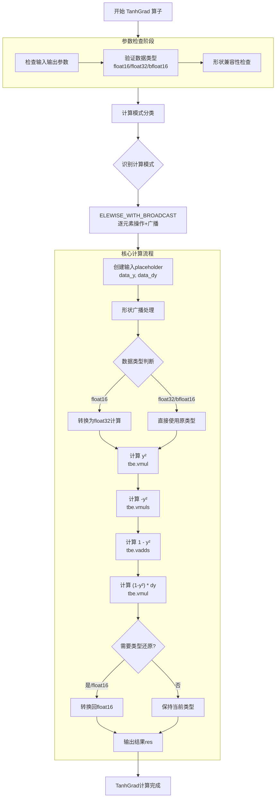

# aclnnTanhGrad

## 产品支持情况

| 产品                                                                | 是否支持 |
|:----------------------------------------------------------------- |:----:|
| <term>Atlas A2 训练系列产品/Atlas 800I A2 推理产品/A200I A2 Box 异构组件</term> | √    |

## 功能说明

+ 算子功能：计算 tanh_grad(y, dy) = (1 - y²) * dy。
+ 计算公式如下：

$$
out = \tanh\_grad(y, dy) = (1 - y^2) \cdot dy
$$

## 算子原型设计

| 参数名    | 类别   | 描述   | 数据类型                       | 数据格式 |
|:------:|:----:|:----:|:--------------------------:|:----:|
| y      | 输入张量 | 输入张量 | bfloat16, float16, float32 | ND   |
| dy     | 输入张量 | 输入张量 | bfloat16, float16, float32 | ND   |
| output | 输出张量 | 输出张量 | 与input一致                   | ND   |

- <term>Atlas A2 训练系列产品/Atlas 800I A2 推理产品/A200I A2 Box 异构组件</term>：数据类型支持 bfloat16, float16, float32。

## 约束说明

无

## 调用说明

| 调用方式    | 样例代码                                                                   | 说明                                  |
|:------- |:---------------------------------------------------------------------- |:----------------------------------- |
| aclnn接口 | [test_tanh_grad](ops-math/tanh_grad/examples/test_aclnn_tanh_grad.cpp) | 通过[aclnnTanhGrad]接口方式调用tanh_grad算子。 |

## 需求来源

### tanh_grad算子实现优化

基于tanh_grad算子历史TBE版本使用Ascend C编程语言进行优化。
tanh_grad算子（TBE）实现路径和相关API路径
tanh_grad算子实现路径为：/usr/local/Ascend/ascend-toolkit/latest/opp/built-in/op_impl/ai_core/tbe/impl
tanh_grad算子实现中的API路径：/usr/local/Ascend/ascend-toolkit/latest/python/site-packages/tbe/dsl

### tanh_grad算子现状分析

通过对tanh_grad算子TBE版本的功能分析，当前支持的能力如下：

1. tanh_grad算子输入数据input_data支持 bfloat16, float16, float32 格式的输入。
2. tanh_grad算子TBE版本的整体流程图如下图所示：



## 需求总体设计（待修改）

### host侧设计方案

算子暂不支持广播操作，可以将host侧将数据视为一维向量，只需要考虑数据个数，不考虑数据维度信息。

任务均分：采用数据并行策略，将输入数据均匀分配到多个AI Core上。

批量搬运：tileBlockNum 和 tileDataNum 计算单次搬运的数据量，通过 finalSmallTileNum 和 finalBigTileNum 确定小核/大核的搬运次数，将多次搬运合并为批量操作，减少冗余开销。尾块的处理逻辑确保不完整块也能被合并到计算流程中，避免数据碎片。

#### tiling策略

1. 分核策略
   
   1. 优先使用满核的原则。
   
   2. 采用数据并行策略，将输入数据均匀分配到多个AI Core上。
   
   3. 优先使用满核原则，充分利用硬件资源。
   
   4. 数据分配原则：
      当总数据量能被核数整除时，各核处理相等数据块；
      当不能整除时，前 remainder = total_size % core_num 个核多处理1个数据块；
      单核处理数据量不超过硬件限制。
   
   5. 输入数据大小计算：通过GetInputShape和GetDataTypeLength函数获取输入数据的大小和类型长度，计算出输入数据的总字节数。
   
   6. UB内存大小和核心数量获取：通过平台信息获取UB内存大小和核心数量，并根据这些信息调整核心数量。

2. 数据分块和内存优化策略
   
   1. 充分使用UB空间的原则。
   
   2. 需要考虑不同硬件的UB大小不同、是否开启double buffer、kernel侧API实现过程中是否需要临时数据的储存，综合考虑单核内切分的大小。
      UB内存大小获取：通过GetCoreMemSize函数获取UB内存的大小，用于后续的数据切分计算。
      Tile块计算：根据UB内存大小和预定义的BLOCK_SIZE及BUFFER_NUM，计算出每个Tile块的数据数量。
      数据切分：将输入数据按照计算出的Tile块大小进行切分，计算出每个core需要处理的数据块数量和最后一个block的剩余数据量。
      设置切分参数：将计算出的切分参数（如每个core的数据量、Tile块大小等）设置到TilingData对象中。
      这些策略确保了数据在多个核心之间的均匀分布，并且在单个核心内进行了合理的切分，以提高并行处理的效率。

3. tilingkey规划策略
   
   1. 需要tilingkey的情况：需要感知host侧信息对kernel侧走不同分支。
   2. 不需要tilingkey的情况：host侧的处理是通用的，无特殊属性等决定kernel的分支。

### kernel侧设计

进行Init和Process两个阶段，其中Process包括计算（Compute）、搬出（CopyOut）两个阶段。

1. Ascend C 的 tanh_grad算子流程见下图。

```mermaid

```
